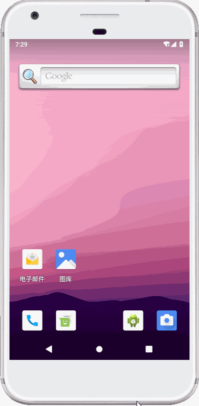

# flutter_select

> 一次学习Flutter的过程，一个简单的单选或者多选。


## 截图

## 导入
```
flutter_sujian_select:^1.0.1
```

```
import 'package:flutter_sujian_select/flutter_select.dart';
```

##使用

单选
```
SelectGroup<int>(
              index:0,
              items: <SelectItem<int>>[
                SelectItem(label: '30天',value: 1),
                SelectItem(label: '60天',value: 2),
                SelectItem(label: '90天',value: 3),
              ],
              onSingleSelect: (int value){
              
              },
            ),

```

多选
```
SelectGroup<int>(
              type: SelectType.multiple,
              style: SelectStyle.rectangle,
              direction: SelectDirection.vertical,
              listIndex: [1,2],
              items: <SelectItem<int>>[
                SelectItem(label: '1',value: 1),
                SelectItem(label: '2',value: 2),
                SelectItem(label: '3',value: 3),
                SelectItem(label: '4',value: 4),
              ],
              onMultipleSelect: (List<int> value){
             
              },
            ),
```


## 属性说明


| 属性 | 描述 | 默认值 |
| ------ | ------ | ------ |
| borderColor | 边框颜色 | Colors.blue |
| unSelectColor | 未选中背景颜色 | Colors.white |
| selectColor | 选中颜色 | Colors.blue |
| space | item之间的距离 | const EdgeInsets.all(0.0) |
| padding | 内边距 | const EdgeInsets.all(8.0) |
| isRepeatBorderLine | 是否去掉重复的线（矩形生效） | false |
| type | 选择类型 | SelectType.single |
| style | item风格 | SelectStyle.circular |
| direction | 排列方向 | SelectDirection.horizontal |
| index | 默认值（单选可用） | null |
| listIndex | 默认值（多选可用） | null |
| onSingleSelect | 单选回调（单选可用） | null |
| onMultipleSelect | 多选回调（单选可用） | null |
| items | 选项（必要） | null |


